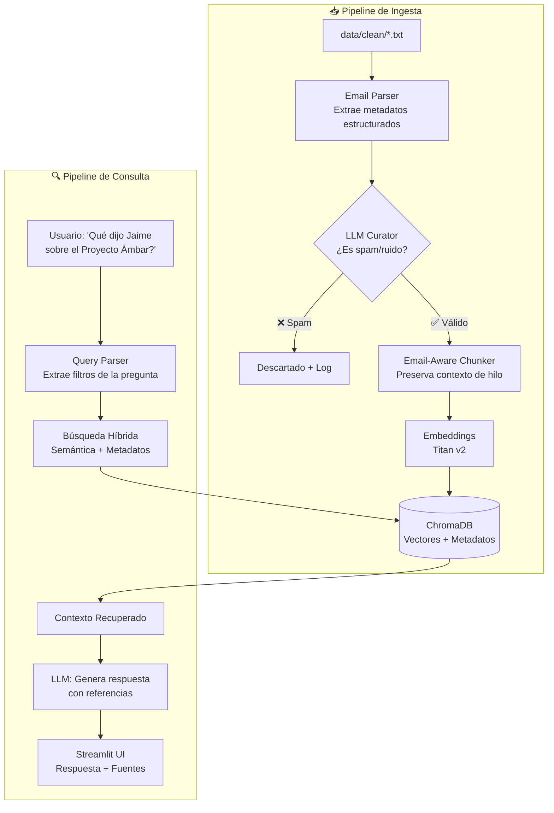
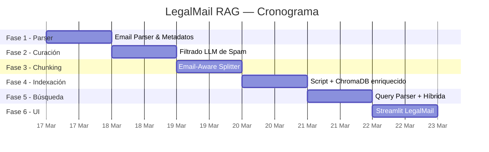

# 🗺️ LegalMail RAG — Hoja de Ruta de Implementación

Transformar el RAG genérico actual en **LegalMail RAG**: un sistema de inteligencia documental especializado en correos electrónicos legales con búsqueda híbrida (semántica + metadatos).

---

## Estado Actual del Proyecto

Ya existe una base sólida:

| Componente | Estado | Archivo |
|---|---|---|
| Embeddings (Bedrock Titan) | ✅ Listo | [aws_embeddings.py](file:///Users/sergicortes/Desktop/WORK/HIBERUS/ADVANCE%20RAGS/university_curso_rag_2026_ru/rag-chatbot-aws/src/embeddings/aws_embeddings.py) |
| Vector Store (ChromaDB) | ✅ Listo | [chroma_store.py](file:///Users/sergicortes/Desktop/WORK/HIBERUS/ADVANCE%20RAGS/university_curso_rag_2026_ru/rag-chatbot-aws/src/vectorstore/chroma_store.py) |
| Text Splitter genérico | ✅ Listo | [text_splitter.py](file:///Users/sergicortes/Desktop/WORK/HIBERUS/ADVANCE%20RAGS/university_curso_rag_2026_ru/rag-chatbot-aws/src/ingestion/text_splitter.py) |
| RAG Chain conversacional | ✅ Listo | [rag_chain.py](file:///Users/sergicortes/Desktop/WORK/HIBERUS/ADVANCE%20RAGS/university_curso_rag_2026_ru/rag-chatbot-aws/src/chains/rag_chain.py) |
| Document Loader multi-formato | ✅ Listo | [document_loader.py](file:///Users/sergicortes/Desktop/WORK/HIBERUS/ADVANCE%20RAGS/university_curso_rag_2026_ru/rag-chatbot-aws/src/ingestion/document_loader.py) |
| Streamlit UI genérica | ✅ Listo | [streamlit_app.py](file:///Users/sergicortes/Desktop/WORK/HIBERUS/ADVANCE%20RAGS/university_curso_rag_2026_ru/rag-chatbot-aws/app/streamlit_app.py) |
| Data Cleaning (CSV → TXT) | ✅ Listo | [data_cleaning.py](file:///Users/sergicortes/Desktop/WORK/HIBERUS/ADVANCE%20RAGS/university_curso_rag_2026_ru/rag-chatbot-aws/src/clean/data_cleaning.py) |
| Datos: 42 emails legales + 10 spam | ✅ Listo | `data/clean/email_*.txt` |

---

## Arquitectura Objetivo



---

## Fases de Implementación

### Fase 1 — Email Parser & Extracción de Metadatos
> **Prioridad:** 🔴 Crítica · **Esfuerzo:** ~2h

**Objetivo:** Parsear los [.txt](file:///Users/sergicortes/Desktop/WORK/HIBERUS/ADVANCE%20RAGS/university_curso_rag_2026_ru/rag-chatbot-aws/requirements.txt) de `data/clean/` y extraer metadatos estructurados.

#### [NEW] [email_parser.py](file:///Users/sergicortes/Desktop/WORK/HIBERUS/ADVANCE%20RAGS/university_curso_rag_2026_ru/rag-chatbot-aws/src/ingestion/email_parser.py)

Nuevo módulo que parsea el formato actual de los emails:

```python
# Campos a extraer de cada email:
{
    "from_name": "D. Jaime Cortés Villanueva",
    "from_email": "j.cortes@cortesvillanueva-law.com",
    "to_name": "D.ª Isabel Prado Ramos",
    "to_email": "i.prado@fondoinversion-crest.com",
    "date": "2026-03-15",           # datetime parseado
    "date_iso": "2026-03-15T08:44:00",
    "subject": "RE: Proyecto Ámbar — Litigio PI...",
    "thread_id": "proyecto_ambar",  # extraído del asunto (RE:, FWD:)
    "attachments": ["07_Due_Diligence_MA.docx"],
    "body": "Isabel, sobre el litigio de PI...",
}
```

- Regex para parsear headers (`De:`, `Para:`, `Fecha:`, etc.)
- Detección de `Thread_ID` a partir de patrones `RE:` / `FWD:` en el asunto
- Retorna `LangChain Document` con `page_content` = cuerpo y `metadata` = campos estructurados

---

### Fase 2 — Curación con LLM (Filtrado de Spam)
> **Prioridad:** 🟡 Alta · **Esfuerzo:** ~2h

**Objetivo:** Usar el LLM para clasificar y descartar emails que son spam/phishing antes de indexar.

#### [NEW] [email_curator.py](file:///Users/sergicortes/Desktop/WORK/HIBERUS/ADVANCE%20RAGS/university_curso_rag_2026_ru/rag-chatbot-aws/src/ingestion/email_curator.py)

```python
# Prompt de curación:
"""
Analiza el siguiente email y clasifícalo:
- LEGÍTIMO: Email profesional/legal relevante
- SPAM: Publicidad, phishing, correo basura

Email:
{email_content}

Responde SOLO con: LEGÍTIMO o SPAM
Justificación breve:
"""
```

- Llamada a Bedrock con el email completo
- Batch processing con rate limiting
- Genera log/reporte de emails descartados en `data/curation_report.json`
- Los 10 `email_dirty_*.txt` deberían ser filtrados automáticamente

---

### Fase 3 — Chunking Inteligente para Emails
> **Prioridad:** 🔴 Crítica · **Esfuerzo:** ~1.5h

**Objetivo:** Adaptar el text splitter para preservar el contexto del email en cada chunk.

#### [MODIFY] [text_splitter.py](file:///Users/sergicortes/Desktop/WORK/HIBERUS/ADVANCE%20RAGS/university_curso_rag_2026_ru/rag-chatbot-aws/src/ingestion/text_splitter.py)

Añadir clase `EmailAwareTextSplitter`:

- Para emails cortos (< `chunk_size`): **no dividir** — un email = un chunk
- Para emails largos: dividir el cuerpo pero **prefijar cada chunk** con un resumen del header:
  ```
  [Email de Jaime Cortés a Isabel Prado | 2026-03-15 | Proyecto Ámbar]
  {chunk del cuerpo}
  ```
- Preservar todos los metadatos del parser en cada chunk

---

### Fase 4 — Indexación con Metadatos Enriquecidos
> **Prioridad:** 🔴 Crítica · **Esfuerzo:** ~2h

**Objetivo:** Script de indexación que orqueste Parser → Curator → Chunker → ChromaDB.

#### [NEW] [index_emails.py](file:///Users/sergicortes/Desktop/WORK/HIBERUS/ADVANCE%20RAGS/university_curso_rag_2026_ru/rag-chatbot-aws/scripts/index_emails.py)

```bash
# Uso:
python scripts/index_emails.py --dir data/clean --curate --clear
```

Pipeline completo:
1. Lee todos los `.txt` de `data/clean/`
2. Parsea metadatos con `EmailParser`
3. (Opcional) Filtra spam con `EmailCurator`
4. Divide con `EmailAwareTextSplitter`
5. Indexa en ChromaDB con metadatos ricos

### Fase 5 — Corrección de Filtros y Relevancia (v2)
> **Prioridad:** 🔴 Crítica · **Esfuerzo:** ~1h

**Objetivo:** Solucionar el fallo en el filtro de fechas, corregir el bug de inversión en la relevancia y añadir representación visual por colores.

#### 1. Corrección Filtro de Fecha (ChromaDB)
- **Problema:** `$contains` no funciona para cadenas en metadatos.
- **Solución:** Usar los campos `year` (int) y `month` (int) que ya existen en los metadatos.
- **Cambio:** En `helpers.py`, desglosar el `YYYY-MM` de la UI y filtrar por enteros.

#### 2. Corrección y Visualización de Relevancia
- **Corrección:** `similarity_search_with_relevance_scores` ya devuelve un valor de similitud [0,1]. Mi lógica actual lo estaba invirtiendo (`1 - score`).
- **Nueva Lógica:** Usar el score directamente: `Similitud % = score * 100`.
- **Representación por Colores:**
  - 🟢 **Verde** (> 85%): Coincidencia alta.
  - 🟡 **Amarillo** (70-85%): Coincidencia media.
  - 🟠 **Naranja** (50-70%): Coincidencia baja.
  - 🔴 **Rojo** (< 50%): Poca relación semántica.
- **UI:** Añadir un badge de color junto al porcentaje en Streamlit.

#### [NEW] [query_parser.py](file:///Users/sergicortes/Desktop/WORK/HIBERUS/ADVANCE%20RAGS/university_curso_rag_2026_ru/rag-chatbot-aws/src/retrieval/query_parser.py)

Usa el LLM para extraer filtros de la pregunta del usuario:

```python
# Input:  "Qué dijo Jaime sobre el Proyecto Ámbar en marzo?"
# Output:
{
    "semantic_query": "Proyecto Ámbar actualización",
    "filters": {
        "from_name": "Jaime",        # búsqueda parcial
        "date_range": ["2026-03-01", "2026-03-31"],
        "thread_id": "proyecto_ambar"
    }
}
```

- Prompt engineering para extraer: remitente, destinatario, rango de fechas, hilo, tema
- Fallback a búsqueda puramente semántica si no hay filtros detectados

#### [MODIFY] [retriever.py](file:///Users/sergicortes/Desktop/WORK/HIBERUS/ADVANCE%20RAGS/university_curso_rag_2026_ru/rag-chatbot-aws/src/retrieval/retriever.py)

Evolucionar `SmartRetriever` a `HybridEmailRetriever`:

- Combina búsqueda semántica (vector similarity) con filtros de metadatos de ChromaDB
- Soporte para filtrado por rango de fechas (`$gte`, `$lte` en ChromaDB)
- Reranking opcional: priorizar emails del mismo hilo

#### [MODIFY] [helpers.py](file:///Users/sergicortes/Desktop/WORK/HIBERUS/ADVANCE%20RAGS/university_curso_rag_2026_ru/rag-chatbot-aws/src/utils/helpers.py)

- Ampliar `build_metadata_filter()` para soportar filtros de email: `from_name`, `to_name`, `thread_id`, `date`

#### [MODIFY] [rag_chain.py](file:///Users/sergicortes/Desktop/WORK/HIBERUS/ADVANCE%20RAGS/university_curso_rag_2026_ru/rag-chatbot-aws/src/chains/rag_chain.py)

- Actualizar prompts del sistema para contexto legal/email:
  ```
  Eres un asistente legal especializado en buscar información en correos
  electrónicos corporativos. Siempre cita el remitente, fecha y asunto
  del email fuente. Si la información no está en los correos, dilo
  explícitamente.
  ```
- Integrar `QueryParser` antes del retriever para extraer filtros automáticamente

---

### Fase 6 — UI Streamlit Especializada
> **Prioridad:** 🟡 Alta · **Esfuerzo:** ~3h

**Objetivo:** Rediseñar la interfaz para el contexto legal/email.

#### [MODIFY] [streamlit_app.py](file:///Users/sergicortes/Desktop/WORK/HIBERUS/ADVANCE%20RAGS/university_curso_rag_2026_ru/rag-chatbot-aws/app/streamlit_app.py)

**Sidebar rediseñado:**
- 📊 Estadísticas: nº emails indexados, remitentes únicos, rango de fechas
- 🔍 Filtros avanzados:
  - Selector de remitente (desplegable con valores de la DB)
  - Rango de fechas (date picker)
  - Filtro por hilo/thread
- 📥 Re-indexación manual con botón

**Área de chat:**
- Branding "LegalMail RAG" con icono de sobre/bufete
- Preguntas sugeridas:
  - *"¿Cuáles son los riesgos del Proyecto Ámbar?"*
  - *"¿Qué adjuntos envió Jaime Cortés?"*
  - *"Resume los emails sobre due diligence"*
- Fuentes renderizadas como tarjetas de email (De, Para, Fecha, Asunto)

---

## Resumen Visual de Cambios

| Archivo | Acción | Fase |
|---|---|---|
| `src/ingestion/email_parser.py` | 🆕 Nuevo | F1 |
| `src/ingestion/email_curator.py` | 🆕 Nuevo | F2 |
| `src/ingestion/text_splitter.py` | ✏️ Modificar | F3 |
| `scripts/index_emails.py` | 🆕 Nuevo | F4 |
| `src/vectorstore/chroma_store.py` | ✏️ Modificar | F4 |
| `config/settings.py` | ✏️ Modificar | F4 |
| `src/retrieval/query_parser.py` | 🆕 Nuevo | F5 |
| `src/retrieval/retriever.py` | ✏️ Modificar | F5 |
| `src/utils/helpers.py` | ✏️ Modificar | F5 |
| `src/chains/rag_chain.py` | ✏️ Modificar | F5 |
| `app/streamlit_app.py` | ✏️ Modificar | F6 |
| `requirements.txt` | ✏️ Modificar | F1 |

---

## Cronograma Propuesto



> **Tiempo total estimado: ~14h de desarrollo** (distribuible en ~4 sesiones de trabajo)

---

## Verification Plan

### Fase 1 — Email Parser
```bash
# Test manual: parsear un email y verificar metadatos
python -c "
from src.ingestion.email_parser import EmailParser
docs = EmailParser().parse_file('data/clean/email_001.txt')
print(docs[0].metadata)
# Debe imprimir: from_name, from_email, to_name, to_email, date, subject, thread_id, attachments
"
```

### Fase 2 — Curación
```bash
# Test: verificar que los 10 emails dirty son rechazados
python -c "
from src.ingestion.email_curator import EmailCurator
from config.settings import Settings
curator = EmailCurator(Settings())
# Probar con un email de spam
result = curator.classify('data/clean/email_dirty_001.txt')
print(result)  # Debe ser 'SPAM'
"
```

### Fase 4 — Indexación end-to-end
```bash
# Indexar todos los emails y verificar conteo
python scripts/index_emails.py --dir data/clean --curate --clear
# Debe indexar ~42 emails y rechazar ~10 spam
```

### Fase 5 — Búsqueda híbrida
```bash
# Test con Streamlit corriendo:
streamlit run app/streamlit_app.py
# Pregunta: "¿Qué dijo Jaime Cortés sobre el Proyecto Ámbar?"
# Debe retornar emails de Jaime Cortés con thread "Proyecto Ámbar"
```

### Verificación Manual Completa
1. Ejecutar `python scripts/index_emails.py --dir data/clean --curate --clear`
2. Verificar en logs que los 10 `email_dirty_*` fueron descartados
3. Lanzar `streamlit run app/streamlit_app.py`
4. En la UI verificar:
   - Sidebar muestra estadísticas de emails (≈42 indexados)
   - Los filtros de remitente y fecha funcionan
   - Las preguntas sugeridas generan respuestas relevantes con fuentes citadas
